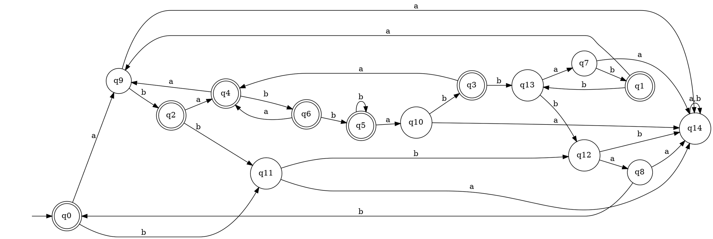
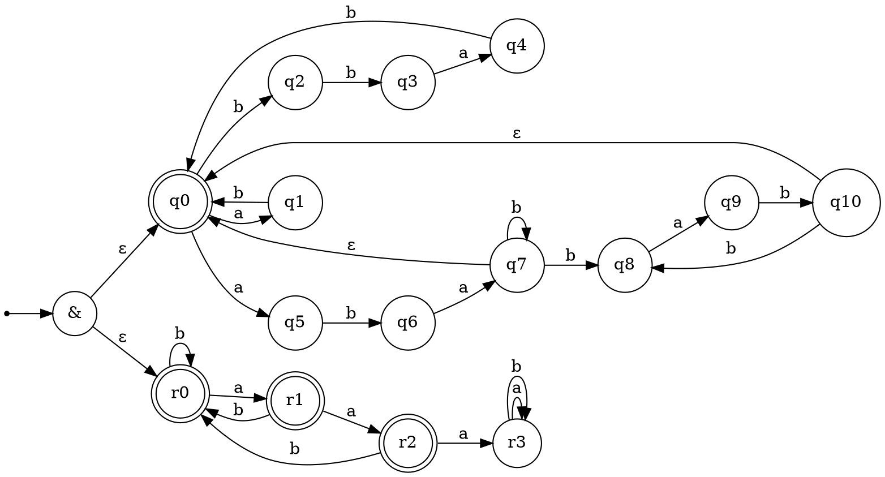

# Лабораторная работа №1

R=((bba∣a)b∣abab*(bab)*)*.

## ДКА

Алфавит: {a, b}
Начальное состояние: q_0
Конечные состояния: q_0-6

### Таблица классов эквивалентности
| Состояние/слово    | ε | a | ab | abbab | b | ba | bab | bbab |
|--------------------|---|---|----|-------|---|----|-----|------|
| (q0)  ε            | + | − | +  | −     | − | −  | −   | +    |
| (q1)  ababbabbab   | + | − | +  | −     | − | −  | +   | +    |
| (q2)  ab           | + | + | +  | +     | − | −  | −   | +    |
| (q3)  ababbab      | + | + | +  | +     | − | −  | +   | +    |
| (q4)  aba          | + | − | +  | −     | + | +  | +   | +    |
| (q5)  ababb        | + | − | +  | +     | + | −  | +   | +    |
| (q6)  abab         | + | + | +  | +     | + | −  | +   | +    |
| (q7)  ababbabba    | − | − | −  | −     | + | −  | +   | +    |
| (q8)  bba          | − | − | −  | −     | + | −  | +   | −    |
| (q9)  a            | − | − | −  | −     | + | +  | +   | −    |
| (q10) ababba       | − | − | −  | −     | + | +  | +   | +    |
| (q11) b            | − | − | −  | −     | − | −  | +   | −    |
| (q12) bb           | − | − | +  | −     | − | −  | −   | −    |
| (q13) ababbabb     | − | − | +  | +     | − | −  | +   | −    |
| (q14) aa (ловушка) | − | − | −  | −     | − | −  | −   | −    |

Все строки попарно различаются -> все состояния находятся в разных классах эквивалетности -> ДКА минимален.

## НКА

Алфавит: {a, b}
Начальное состояние: q_0
Конечные состояния: q_0,6,9

### Таблица множеств классов эквивалентности для НКА

|    | ε | a | ab | abbab | b | ba | bab | bbab |
|--------|---|---|----|-------|---|----|-----|------|
| ε      | + | − | +  | −     | − | −  | −   | +    |
| a      | − | − | −  | −     | + | −  | +   | −    |
| b      | − | − | −  | −     | − | −  | +   | −    |
| bb     | − | − | +  | −     | − | −  | −   | −    |
| aba    | − | − | −  | −     | − | +  | +   | −    |
| ab     | − | + | +  | +     | − | −  | −   | −    |
| abab   | + | − | +  | −     | + | −  | +   | +    |
| ababb  | − | − | +  | +     | − | −  | −   | −    |
| ababa  | − | − | −  | −     | + | −  | +   | +    |
| ababab | + | − | +  | −     | − | −  | +   | +    |

## ПКА
Представим ПКА как персечение двух двух регулярных языков:
1. L_1 - язык, порожденный исходным НКА
2. L_2 - язык слов над ({a,b}), в которых **нет подслова `aaa`**.

